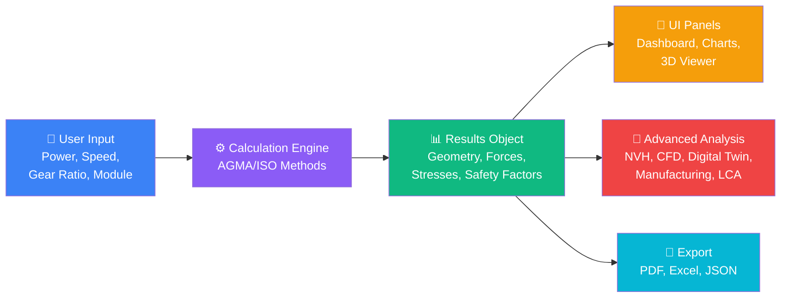
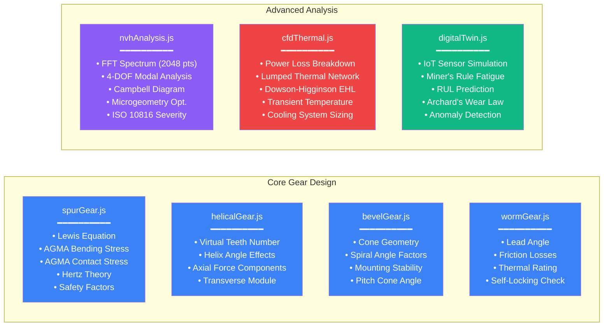
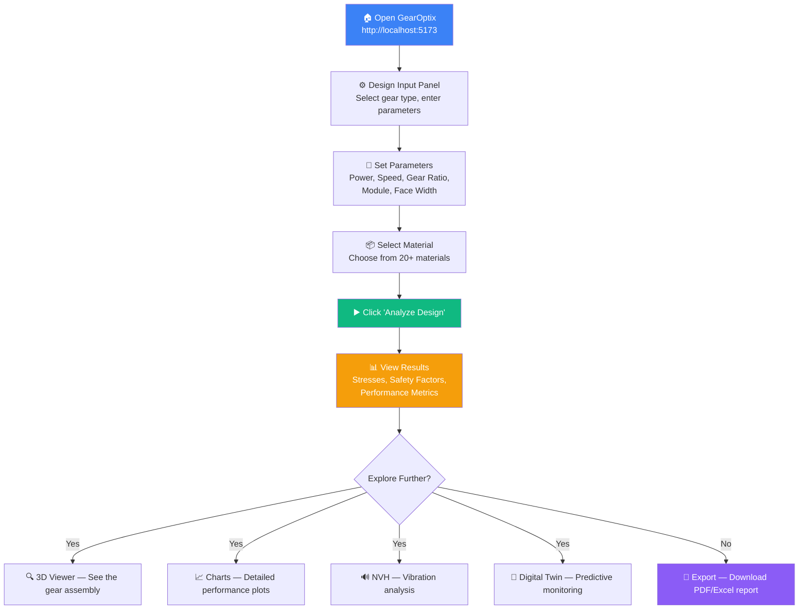
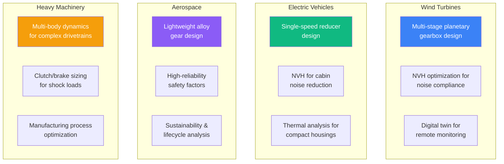
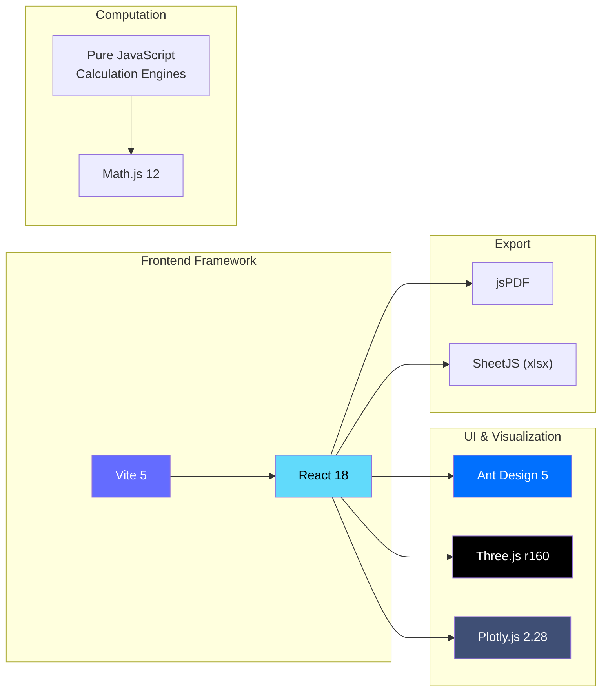

<p align="center">
  
</p>

<h1 align="center">⚙️ GearOptix — Advanced Transmission Design Suite</h1>

<p align="center">
  <b>A comprehensive, web-based gear and transmission design application built with React + Vite</b><br/>
  <i>Featuring AGMA/ISO calculations, 3D visualization, NVH analysis, Digital Twin, CFD thermal simulation, and more</i>
</p>

<p align="center">
  
  
  
  
  
  
</p>

---

## 📋 Table of Contents

- [Overview](#-overview)
- [Key Features](#-key-features)
- [Architecture](#-architecture)
- [Module Breakdown](#-module-breakdown)
- [Installation & Setup](#-installation--setup)
- [Usage Guide](#-usage-guide)
- [For Industry Experts](#-for-industry-experts)
- [Technical Standards](#-technical-standards)
- [Project Structure](#-project-structure)
- [Technology Stack](#-technology-stack)
- [Contributing](#-contributing)
- [License](#-license)

---

## 🌟 Overview

**GearOptix** is a professional-grade, browser-based transmission design suite that implements rigorous AGMA (American Gear Manufacturers Association) and ISO calculation methodologies from the textbook **"Machine Elements in Mechanical Design" by Robert L. Mott**. It provides engineers with a complete toolkit for designing, analyzing, optimizing, and validating gear systems — from initial parameter selection through advanced NVH analysis, digital twin simulation, and sustainability assessment.

### Who Is This For?

| Audience | Value |
|----------|-------|
| **Mechanical Engineers** | Complete AGMA/ISO gear design calculations with safety factors |
| **Industry Professionals** | NVH optimization, CFD thermal analysis, digital twin monitoring |
| **Students** | Educational mode with textbook examples and step-by-step traces |
| **Researchers** | Multi-physics simulation platform with export capabilities |

---

## 🚀 Key Features

### Core Design Engine
- ✅ **4 Gear Types**: Spur, Helical, Bevel, and Worm gears
- ✅ **AGMA 2001-D04 Calculations**: Complete bending & contact stress analysis
- ✅ **15+ AGMA Factors**: K_o, K_v, K_s, K_m, K_B, C_f, C_p, and more
- ✅ **Material Database**: 20+ engineering materials with full mechanical properties
- ✅ **Safety Factor Analysis**: Bending & contact safety factors with reliability factors
- ✅ **3D Gear Visualization**: Interactive Three.js assembly with shafts, bearings, housing

### Advanced Modules (Industry 4.0)
- 🔊 **NVH Analysis** — FFT spectrum, Campbell diagram, modal analysis, microgeometry optimization
- 🔥 **CFD Thermal** — Power loss breakdown, EHL film thickness, transient thermal simulation
- 🤖 **Digital Twin** — IoT sensor simulation, Miner's rule fatigue, RUL prediction
- 🔗 **Multi-Body Dynamics** — Multi-stage cascading, shaft deflection, bearing L10 life
- ⚡ **Motor/Clutch/Brake** — Motor torque-speed curves, clutch engagement, brake stopping
- 🏭 **Manufacturing** — Process selection, heat treatment simulation, DFM scoring
- 🌍 **Sustainability** — Carbon footprint, lifecycle cost, recyclability analysis

### Productivity
- 📊 **Interactive Charts** — Plotly.js powered dynamic visualizations
- 📈 **AI Optimization** — Genetic algorithm for multi-objective gear optimization
- 📄 **Export** — PDF reports, Excel spreadsheets, JSON data
- 📚 **Educational Mode** — Textbook examples with calculation traces

---

## 🏗 Architecture

### System Architecture Diagram

```mermaid
graph TB
    subgraph "Frontend — React + Vite"
        UI["🖥 User Interface<br/>Ant Design Components"]
        SIDEBAR["📱 Sidebar Navigation<br/>14 Panels (7 Core + 7 Advanced)"]
        
        subgraph "Core Panels"
            INPUT["⚙️ Input Form<br/>Design Parameters"]
            RESULTS["📊 Results Dashboard<br/>Analysis Summary"]
            VIEWER["🔍 3D Viewer<br/>Three.js Assembly"]
            OPTIM["🚀 Optimization<br/>Genetic Algorithm"]
            CHARTS["📈 Charts<br/>Plotly.js Visuals"]
            EXPORT["📄 Export<br/>PDF / Excel / JSON"]
            LEARN["📚 Educational<br/>Textbook Examples"]
        end
        
        subgraph "Advanced Panels"
            NVH["🔊 NVH Panel<br/>Vibration Analysis"]
            CFD["🔥 CFD Thermal<br/>Lubrication & Heat"]
            TWIN["🤖 Digital Twin<br/>IoT Monitoring"]
            MBD["🔗 Multi-Body<br/>Drivetrain Assembly"]
            MOTOR["⚡ Motor/Clutch<br/>Drivetrain Components"]
            MFG["🏭 Manufacturing<br/>Process & DFM"]
            LCA["🌍 Sustainability<br/>Lifecycle Analysis"]
        end
    end
    
    subgraph "Calculation Engines — Pure JavaScript"
        SPUR["spurGear.js"]
        HELICAL["helicalGear.js"]
        BEVEL["bevelGear.js"]
        WORM["wormGear.js"]
        NVH_CALC["nvhAnalysis.js"]
        CFD_CALC["cfdThermal.js"]
        TWIN_CALC["digitalTwin.js"]
        MBD_CALC["multibodyDynamics.js"]
        CBM_CALC["clutchBrakeMotor.js"]
        MFG_CALC["manufacturing.js"]
        LCA_CALC["lifecycle.js"]
    end
    
    subgraph "Data Layer"
        MAT["materials.js<br/>20+ Materials"]
        AGMA["agmaFactors.js<br/>AGMA Tables"]
        STD["standardSizes.js<br/>Standard Modules"]
    end
    
    UI --> SIDEBAR
    INPUT --> SPUR & HELICAL & BEVEL & WORM
    NVH --> NVH_CALC
    CFD --> CFD_CALC
    TWIN --> TWIN_CALC
    MBD --> MBD_CALC
    MOTOR --> CBM_CALC
    MFG --> MFG_CALC
    LCA --> LCA_CALC
    SPUR & HELICAL & BEVEL & WORM --> MAT & AGMA & STD
```



### Data Flow Diagram



---

## 📦 Module Breakdown

### Calculation Engines



### Feature Details

<details>
<summary><b>🔊 NVH (Noise, Vibration, Harshness) Analysis</b></summary>

**Purpose**: Predict and optimize gear whine, rattle, and system vibrations.

| Feature | Method | Standard |
|---------|--------|----------|
| Mesh Frequency | N × RPM / 60 | — |
| FFT Spectrum | 2048-point with harmonics + sidebands | — |
| Modal Analysis | 4-DOF (torsional + lateral) | — |
| Campbell Diagram | Speed sweep with resonance crossings | — |
| Transmission Error | AGMA quality-based empirical model | AGMA 908 |
| Sound Pressure Level | Velocity-based dB(A) estimation | — |
| Vibration Severity | RMS velocity classification | ISO 10816 |
| Balancing Grade | Specific unbalance assessment | ISO 1940 |
| Microgeometry | Tip relief, crowning, profile shift optimization | — |

**Key Output**: Interactive FFT spectrum, Campbell diagram with resonance warnings, and microgeometry sliders with real-time feedback.
</details>

<details>
<summary><b>🔥 CFD Thermal & Lubrication Simulation</b></summary>

**Purpose**: Simulate lubrication, heat transfer, and cooling for gear systems.

| Feature | Method | Reference |
|---------|--------|-----------|
| Power Loss | Mesh friction + churning + windage + bearing + seal | Sections 3-20, 16-5 |
| Thermal Network | Lumped-parameter (oil → housing → ambient) | — |
| Transient Simulation | Euler integration (200 min, 200 steps) | — |
| EHL Film Thickness | Dowson-Higginson line contact formula | — |
| Lambda Ratio | h_min / Ra_composite for regime classification | — |
| Lubricant Database | Mineral, Synthetic PAG, PAO with viscosity curves | ISO VG |
| Cooling Sizing | Natural, forced air, oil cooler recommendations | — |
| Churning Map | Loss vs. speed characteristic | Eq 16-5 |

**Key Output**: Power loss pie chart, temperature rise timeline, EHL lambda gauge with regime indicator.
</details>

<details>
<summary><b>🤖 Digital Twin & IoT Dashboard</b></summary>

**Purpose**: Virtual replica for real-time monitoring, predictive maintenance, and lifecycle management.

| Feature | Method | Reference |
|---------|--------|-----------|
| Sensor Simulation | Speed, torque, temperature, vibration, oil condition | — |
| Fatigue Damage | Miner's Rule cumulative damage (D = Σ n_i/N_i) | Section 5-6 |
| RUL Prediction | Linear damage rate extrapolation with confidence | — |
| Wear Prediction | Archard's Law (V = K·F·s/H) | — |
| Anomaly Detection | Threshold-based with severity classification | — |
| Health Score | 100 × (1 - cumulative_damage) | — |
| Maintenance Schedule | Time-based + predictive intervals | — |

**Key Output**: Animated live gauges, health timeline, anomaly log, predictive maintenance table.
</details>

<details>
<summary><b>🔗 Multi-Body Dynamics</b></summary>

**Purpose**: Full drivetrain assembly analysis with shafts, bearings, and multi-stage gear trains.

| Feature | Method | Reference |
|---------|--------|-----------|
| Multi-Stage Cascading | Speed/torque through N stages with efficiency | — |
| Shaft Analysis | Euler-Bernoulli beam, 4-mode critical speeds | Chapters 12, 14 |
| Deflection | F·L³/(48·E·I) center deflection | — |
| Bearing L10 Life | (C/P)^p × 10⁶ revolutions | Chapter 15 |
| Dynamic Response | RK4 integration, 2-DOF torsional model | — |
| Critical Speed | Resonance avoidance analysis | — |

**Key Output**: Visual drivetrain schematic, bending moment diagrams, bearing life table, transient response chart.
</details>

<details>
<summary><b>⚡ Motor, Clutch & Brake Integration</b></summary>

**Purpose**: Design and analyze prime movers, clutches, and brakes for complete drivetrain systems.

| Component | Methods | Reference |
|-----------|---------|-----------|
| **Motor** | Torque-speed curve, efficiency map, thermal derating, standard size selection | — |
| **Clutch** | Uniform wear theory, engagement dynamics, PV wear limit, temperature rise | Eq 22-5 |
| **Brake** | Stopping time/distance, energy absorption, thermal fade coefficient | Chapter 22 |

**Key Output**: Motor T-S curve with operating point, clutch engagement dynamics chart, braking curve with temperature.
</details>

<details>
<summary><b>🏭 Manufacturing & DFM Analysis</b></summary>

**Purpose**: Select optimal manufacturing processes, simulate heat treatment, and assess design-for-manufacturing.

| Feature | Method | Reference |
|---------|--------|-----------|
| Process Selection | 6-process feasibility scoring (hobbing, shaping, grinding, skiving, EDM, SLM) | Section 8-11 |
| Heat Treatment | Carburizing or through-hardening cycle simulation with temperature profiles | — |
| Hardness Gradient | Case depth and HRC through-tooth profile | — |
| Shot Peening | Residual stress and fatigue improvement estimation | Section 18-9 |
| Tolerances | ISO 1328 quality-grade-based tolerances | ISO 1328 |
| Cost Estimation | Material + machining + HT + finishing + setup breakdown | — |
| DFM Scoring | 6-category assessment (undercut, aspect ratio, quality, machinability, module, type) | — |

**Key Output**: Process ranking table, heat treatment cycle chart, cost pie chart, DFM scorecard.
</details>

<details>
<summary><b>🌍 Sustainability & Lifecycle Analysis</b></summary>

**Purpose**: Environmental impact assessment and lifecycle cost optimization.

| Feature | Method | Reference |
|---------|--------|-----------|
| Carbon Footprint | Extraction → Manufacturing → Transport → Operation → Maintenance → Disposal | — |
| Lifecycle Cost | Acquisition + energy loss + maintenance + downtime + disposal | — |
| Recyclability | Per-component recyclability assessment with scrap value | — |
| Energy Payback | ROI for 1% efficiency improvement | — |
| Material Database | CO₂/kg, embodied energy, recyclability for 11 materials | Section 2-18 |
| Sustainability Rating | Composite score (A+ to F) | — |
| Design Comparison | Side-by-side A vs B lifecycle analysis | — |

**Key Output**: CO₂ waterfall chart, lifecycle cost bar chart, recyclability circle gauge, energy payback analysis.
</details>

---

## 💻 Installation & Setup

### Prerequisites

| Requirement | Version | Purpose |
|-------------|---------|---------|
| **Node.js** | ≥ 18.x | JavaScript runtime |
| **npm** | ≥ 9.x | Package manager |
| **Git** | ≥ 2.x | Version control |
| **Modern Browser** | Chrome, Edge, Firefox | WebGL support for 3D |

### Step-by-Step Installation

```bash
# 1. Clone the repository
git clone https://github.com/Ownraza1214/GearOptix.git

# 2. Navigate to the project directory
cd GearOptix

# 3. Install all dependencies
npm install

# 4. Start the development server
npm run dev

# 5. Open in your browser
#    → http://localhost:5173
```

### Alternative: Production Build

```bash
# Build for production (increase memory for large bundle)
set NODE_OPTIONS=--max-old-space-size=4096   # Windows
export NODE_OPTIONS=--max-old-space-size=4096 # macOS/Linux

npm run build

# Preview the production build
npm run preview
```

> **Note**: The production build requires extra memory due to Plotly.js bundle size. The dev server works without any extra configuration.

---

## 📖 Usage Guide

### For New Users — Getting Started



#### Step 1: Launch the Application
Open your browser and navigate to `http://localhost:5173`. You'll see the **GearOptix** interface with a dark premium theme.

#### Step 2: Design Input
- Click **"Design Input"** in the sidebar
- **Select Gear Type**: Spur, Helical, Bevel, or Worm
- **Enter Operating Conditions**:
  - Power (kW) — e.g., `2.237` kW (≈ 3 HP)
  - Pinion Speed (RPM) — e.g., `1750`
  - Gear Ratio — e.g., `3.78`
- **Set Geometry**:
  - Number of Teeth (Pinion) — e.g., `18`
  - Module — e.g., `2`
  - Face Width — e.g., `13` mm
  - Pressure Angle — e.g., `20°`
- **Select Material**: Choose from dropdown (e.g., AISI 4140 OQT 1000)

#### Step 3: Run Analysis
Click the **"Analyze Design"** button. The engine will:
1. Calculate gear geometry (pitch diameter, addendum, dedendum)
2. Compute tangential, radial, and normal forces
3. Apply all AGMA correction factors (K_o, K_v, K_s, K_m, K_B, etc.)
4. Calculate bending and contact stresses
5. Determine safety factors against fatigue failure

#### Step 4: Review Results
The **Analysis Dashboard** shows:
- ✅ Geometry tables (both pinion and gear)
- ✅ Force analysis breakdown
- ✅ AGMA stress analysis with all factors
- ✅ Safety factors with pass/fail indicators
- ✅ Performance metrics (efficiency, PV value, specific sliding)

#### Step 5: Explore Advanced Features
Navigate the **ADVANCED** section in the sidebar:
- **NVH Analysis**: See vibration spectrum, resonance warnings
- **CFD Thermal**: Check oil temperature and lubrication regime
- **Digital Twin**: Run predictive maintenance simulation
- **Manufacturing**: Get manufacturing process recommendations
- **Sustainability**: Assess environmental impact

#### Step 6: Export Results
Use the **Export** panel to download:
- 📄 **PDF Report** — Complete engineering report with tables and parameters
- 📊 **Excel Spreadsheet** — All numerical data for further analysis
- 📋 **JSON Data** — Machine-readable results for integration

---

## 🏭 For Industry Experts

### Supported Analysis Standards

| Standard | Application | Implementation |
|----------|-------------|---------------|
| **AGMA 2001-D04** | Spur & Helical gear rating | Full bending + contact stress |
| **AGMA 2003-C10** | Bevel gear rating | Spiral bevel calculations |
| **AGMA 908** | Gear noise prediction | Transmission error model |
| **ISO 1328** | Gear accuracy | Quality grade tolerances |
| **ISO 10816** | Vibration severity | RMS velocity classification |
| **ISO 1940** | Balancing grade | Specific unbalance assessment |
| **ISO 281** | Bearing life | L10 basic rating life |

### Industrial Use Cases



### Validation Against Textbook

All core calculations can be validated against examples from **"Machine Elements in Mechanical Design" by Robert L. Mott**. The **Educational Mode** includes pre-loaded textbook examples:
- Example 9-1: Spur gear design (3 HP, 1750 RPM)
- Example 9-3: Helical gear design
- Example 10-1: Bevel gear analysis
- Example 10-3: Worm gear design

---

## 📁 Project Structure

```
GearOptix/
├── index.html                      # Entry point
├── package.json                    # Dependencies & scripts
├── vite.config.js                  # Vite configuration
│
├── src/
│   ├── main.jsx                    # React entry
│   ├── App.jsx                     # Root component (routing + state)
│   ├── App.css                     # Global styles (1000+ lines, premium dark theme)
│   │
│   ├── calculations/               # ═══ Calculation Engines ═══
│   │   ├── spurGear.js             # AGMA spur gear analysis
│   │   ├── helicalGear.js          # AGMA helical gear analysis
│   │   ├── bevelGear.js            # AGMA bevel gear analysis
│   │   ├── wormGear.js             # Worm gear thermal & wear analysis
│   │   ├── gearTrain.js            # Gear train kinematics
│   │   ├── shaftDesign.js          # Shaft stress & deflection
│   │   ├── thermalAnalysis.js      # Basic thermal calculations
│   │   ├── vibrationAnalysis.js    # Vibration fundamentals
│   │   ├── nvhAnalysis.js          # ★ NVH: FFT, modal, Campbell
│   │   ├── cfdThermal.js           # ★ CFD: EHL, thermal network
│   │   ├── digitalTwin.js          # ★ Digital Twin: sensors, RUL
│   │   ├── multibodyDynamics.js    # ★ Multi-body: shafts, bearings
│   │   ├── clutchBrakeMotor.js     # ★ Motor, clutch, brake design
│   │   ├── manufacturing.js        # ★ Process, heat treatment, DFM
│   │   └── lifecycle.js            # ★ Carbon footprint, LCA
│   │
│   ├── components/                 # ═══ UI Components ═══
│   │   ├── Sidebar.jsx             # Navigation (14 items)
│   │   ├── Header.jsx              # Top bar with unit toggle
│   │   ├── InputForm.jsx           # Design parameter entry
│   │   ├── ResultsDashboard.jsx    # Analysis results display
│   │   ├── GearVisualizer.jsx      # 3D Three.js gear assembly
│   │   ├── Charts.jsx              # Plotly.js performance charts
│   │   ├── OptimizationPanel.jsx   # Genetic algorithm optimizer
│   │   ├── ExportPanel.jsx         # PDF/Excel/JSON export
│   │   ├── EducationalMode.jsx     # Textbook examples & learning
│   │   ├── NVHPanel.jsx            # ★ NVH analysis dashboard
│   │   ├── CFDSimulation.jsx       # ★ CFD thermal dashboard
│   │   ├── DigitalTwinDashboard.jsx# ★ IoT digital twin
│   │   ├── DrivetrainBuilder.jsx   # ★ Multi-body assembly
│   │   ├── DrivetrainComponents.jsx# ★ Motor/clutch/brake
│   │   ├── ManufacturingPanel.jsx  # ★ Manufacturing & DFM
│   │   └── SustainabilityPanel.jsx # ★ Lifecycle analysis
│   │
│   ├── data/                       # ═══ Reference Data ═══
│   │   ├── materials.js            # Material properties database
│   │   ├── agmaFactors.js          # AGMA factor tables
│   │   └── standardSizes.js        # Standard module sizes
│   │
│   ├── optimization/               # ═══ Optimization ═══
│   │   └── geneticAlgorithm.js     # GA for multi-objective optimization
│   │
│   └── utils/                      # ═══ Utilities ═══
│       └── helpers.js              # Shared helper functions
│
└── ★ = Advanced Industry 4.0 modules
```

---

## 🛠 Technology Stack



| Technology | Version | Purpose |
|-----------|---------|---------|
| React | 18.2 | UI component framework |
| Vite | 5.0 | Build tool & dev server |
| Ant Design | 5.13 | Premium UI component library |
| Three.js | r160 | 3D gear visualization |
| @react-three/fiber | 8.15 | React Three.js integration |
| @react-three/drei | 9.92 | Three.js helpers |
| Plotly.js | 2.28 | Interactive charts & graphs |
| Math.js | 12.2 | Mathematical computations |
| jsPDF | 2.5 | PDF report generation |
| SheetJS (xlsx) | 0.18 | Excel spreadsheet export |

---

## 🤝 Contributing

Contributions are welcome! Please follow these steps:

1. **Fork** the repository
2. **Create** a feature branch: `git checkout -b feature/amazing-feature`
3. **Commit** your changes: `git commit -m 'Add amazing feature'`
4. **Push** to the branch: `git push origin feature/amazing-feature`
5. **Open** a Pull Request

### Development Guidelines
- Follow existing code style and naming conventions
- Add calculation traces for new engineering modules
- Reference textbook equations with section numbers
- Test new gear types with known textbook examples

---

## 📜 License

This project is licensed under the MIT License — see the [LICENSE](LICENSE) file for details.

---

## 📚 References

1. Mott, R.L. — *Machine Elements in Mechanical Design*, 6th Edition
2. AGMA 2001-D04 — *Fundamental Rating Factors and Calculation Methods for Involute Spur and Helical Gear Teeth*
3. AGMA 2003-C10 — *Rating the Pitting Resistance and Bending Strength of Generated Straight Bevel, Zerol Bevel and Spiral Bevel Gear Teeth*
4. ISO 1328 — *Cylindrical Gears — ISO System of Flank Tolerance Classification*
5. ISO 10816 — *Mechanical Vibration — Evaluation of Machine Vibration*
6. Dowson, D. & Higginson, G.R. — *Elastohydrodynamic Lubrication*

---

<p align="center">
  <b>Built with ❤️ for the Mechanical Engineering Community</b><br/>
  <i>⚙️ GearOptix — Where Engineering Meets Innovation</i>
</p>
